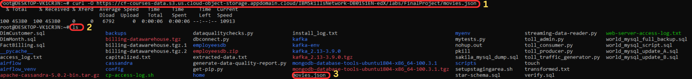

# NoSQL-Projects-Portfolio
## 1. Project Overview

### Scenario  
As a Data Engineer at a data analytics consulting firm, my primary role involves:  
- Efficiently handling data across different formats, platforms, and databases.  
- Integrating external datasets into NoSQL databases to support analytical workflows.  
- Problem-solving real-world challenges by designing streamlined data ingestion and retrieval processes.  

### Dataset Overview  
The dataset used for this project is a JSON file of movie information, showcasing various fields including title, genre, release year, and additional metadata. The data file was obtained using the following command:  
```bash
curl -O https://cf-courses-data.s3.us.cloud-object-storage.appdomain.cloud/IBMSkillsNetwork-DB0151EN-edX/labs/FinalProject/movies.json
```
This dataset reflects common real-world requirements, where datasets from public or proprietary sources need to be processed and utilized effectively.
### Goals  
This portfolio aims to demonstrate key competencies in NoSQL database management, including:

- **Importing JSON data into MongoDB**.
- **Querying the imported data to retrieve insights**.
- **Exporting MongoDB data into usable formats**.
- **Loading the JSON data into Apache Cassandra with a well-designed schema**.
- **Querying Cassandra tables for analytical purposes**.
## Tools & Technologies  
This project leverages several tools and technologies to manage NoSQL databases and ensure seamless data processing:

- **MongoDB Tools**:
  - **mongosh**: The MongoDB shell used for interacting with the MongoDB database from the command line.
  - **MongoDB Compass**: A GUI for managing MongoDB databases, useful for visualizing data and running queries.

- **Apache Cassandra Tools**:
  - **cqlsh**: The Cassandra Query Language shell, used to interact with Apache Cassandra from the command line.

- **Environment**:
  - **WSL (Windows Subsystem for Linux)**: A Linux environment running on Windows, used for setting up MongoDB, Apache Cassandra, and executing scripts.

- **Programming Languages**:
  - **Python**: For writing automation scripts, querying databases, and handling data transformations.
  - **Bash**: For shell scripting to automate various database tasks such as imports and exports.

These tools ensure smooth integration, management, and querying of the databases involved in the project.

## Setting the Environment

### 1. Start MongoDB
Before working with MongoDB, we need to start the MongoDB service. This is done by running the following command in the terminal:

```bash
mongod --dbpath /data/db
```
This command starts the MongoDB server and sets the database path to `/data/db`, which is where MongoDB will store its data files.
#### 2. Open MongoDB Shell (mongosh)
Next, open a new terminal window and start the mongosh environment to interact with the MongoDB instance:
```bash
mongosh
```
This opens the MongoDB shell, where you can run MongoDB commands and interact with the database.

### 3. Create an Admin User
To create an admin user for MongoDB, we first enter the following command to enable us to create an admin user:
```javascript
db.createUser({
  user: "admin",
  pwd: "nnannaeze@77",
  roles: [{ role: "root", db: "admin" }]
})
```
Once the admin user is created, we can update the password of the existing `root`user if needed with the following command:
```javascript
db.updateUser("root", { pwd: "nnannaeze@77" });
```
This ensures that the `root` user has the correct password, and now we have an admin user with full access to the MongoDB instance.

## MongoDB Workflow
### 1. **Importing Data into MongoDB**  
To get started with the project, I obtained the dataset in JSON format (movie information) using the following `curl` command:

```bash
curl -O https://cf-courses-data.s3.us.cloud-object-storage.appdomain.cloud/IBMSkillsNetwork-DB0151EN-edX/labs/FinalProject/movies.json
```
This command downloaded the movies.json file, which contains data on various movies, including fields such as title, genre, year, director, and more.



To import the JSON data into MongoDB, I used the `mongoimport` tool. The command below was executed from the command line:

```bash
mongoimport -u root -p nnannaeze@77 --authenticationDatabase admin --db entertainment --collection movies --file movies.json --host localhost
```

.png)

This command connects to the local MongoDB instance, authenticates the user with the specified password, and loads the `movies.json` file into the `movies` collection in the `entertainment` database.
#### Breakdown of the Command:

- `-u root`: Specifies the username for authentication.
- `-p nnannaeze@77`: The password associated with the specified username.
- `--authenticationDatabase admin`: Defines the database to authenticate against, which in this case is `admin`.
- `--db entertainment`: The target database where the data should be imported. In this case, the target database is named `entertainment`.
- `--collection movies`: Specifies the specific collection within the `training` database where the movie data will be stored. The collection is named `movies`.
- `--file movies.json`: Points to the local file containing the movie data to be imported. In this case, it refers to the `movies.json` file.
- `--host localhost`: Indicates that MongoDB is hosted on the local machine.

This command successfully imports the movie data from `movies.json` into the MongoDB instance. The data is now available in the `movies` collection of the `training` database, ready for further querying and analysis.

### 2. **Querying Data in MongoDB**
After the data was imported, I ran several queries to retrieve valuable insights. Below are some example queries and their descriptions:
**Sample movie document:**
```json
{
  "_id": "9",
  "title": "The Lost City of Z",
  "genre": "Action,Adventure,Biography",
  "Description": "A true-life drama, centering on British explorer Col. Percival Fawcett, who disappeared while searching for a mysterious city in the Amazon in the 1920s.",
  "Director": "James Gray",
  "Actors": "Charlie Hunnam, Robert Pattinson, Sienna Miller, Tom Holland",
  "year": 2016,
  "Runtime (Minutes)": 141,
  "rating": "unrated",
  "Votes": 7188,
  "Revenue (Millions)": 8.01,
  "Metascore": 78
}
```
-  ***Query to find the year with the most number of movie releases:***
  ```javascript
  db.movies.aggregate([
  { $group: { _id: "$year", count: { $sum: 1 } } },
  { $sort: { count: -1 } },
  { $limit: 1 }
  ])
  ```
  This query groups the movies by `year` and counts how many movies were released in each year. The results are sorted in descending order, and the top result is returned.
  
  #### Explanation:

  -  `$group`: Groups the documents by the year field and calculates the total count of movies released each year.
  
  -  `$sum`: 1: Adds 1 for each document grouped by year, effectively counting the number of movies per year.
  
  -  `$sort`: Sorts the results in descending order based on the count field, so the year with the most movies appears first.
  
  -  `$limit: 1`: Limits the result to only the year with the highest count of movies.

  
-  ***Query to find the count of movies released after the year 1999:***
  ```javascript
  db.movies.countDocuments({ year: { $gt: 1999 } })
  ```
  
  #### Explanation:
  -  This query counts all movies where the year field is greater than 1999, effectively giving the total number of movies released after that year.
  
  
-  ***Query to find the average votes for movies released in 2007:***
  ```javascript
  db.movies.aggregate([
  { $match: { year: 2007 } },
  { $group: { _id: null, averageVotes: { $avg: "$Votes" } } }
  ])
  ```
  This query filters the movies for the year 2007 and calculates the average number of votes.
  #### Explanation:

  - `$match`: Filters the documents to include only those where the `year` is 2007.
  - `$group`: Calculates the average (`$avg`) of the `Votes` field for movies released in that year. The result is returned as `averageVotes`.

    
###  3. **Exporting Data from MongoDB**
To export a subset of fields from the movies collection into a CSV file, I used the `mongoexport`command with the specific fields. The following command exports the `_id`, `title`, `year`, `rating`, and `director` fields:
```bash
mongoexport -u root -p nnannaeze@77 --authenticationDatabase admin --db training --collection movies --fields _id,title,year,rating,director --type=csv --out partial_data.csv
```
#### Explanation:

- `--fields _id,title,year,rating,director`: Specifies the fields to include in the export. In this case, only the `_id`, `title`, `year`, `rating`, and `director` fields are chosen.
- `--type=csv`: Specifies the export format as CSV.
- `--out partial_data.csv`: Defines the output file as `partial_data.csv`.

This command exports the specified fields from the `movies` collection to a CSV file. The resulting CSV file can be opened in tools like Excel or used for further analysis.

  

